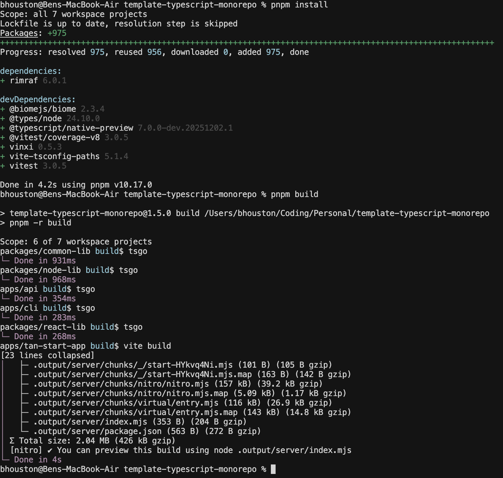

# TypeScript + Cli + Rest API + React App Mono Repository

This is a template for a monorepo that uses best practices for TypeScript, Web Services and React.

It is what @bhouston considers best practice in November 2025.

This app is maintained in part by https://mycoder.ai

## The end result

## Features

- Mono-repository using pnpm workspaces
- TypeScript (native compiler preview) for type safety
- ES Modules for fast builds
- NodeNext node resolution
- React for UI
- Tailwindcss for styling
- Both react and vanilla JS libraries
- Command line, React app, and web server
- Vite for Bundling, CSS Handling, Live Reloading
- CLI via @yargs + file commands
- @TanStack/start for router, SSR, server API
- Fastify for server with file-based router
- Hot reload of React
- Auto service restart for the web server
- Biome for code formatting & linting
- VSCode will auto-format on save and paste
- Vitest for testing with coverage support
- Github action CI

## Getting Started

1. Clone this repository
2. Run `pnpm install`

### Tests

1. Run `pnpm test` to run all tests
2. Run `pnpm test:watch` for watch mode during development
3. Run `pnpm test:coverage` to generate test coverage report

### Continuous Dev Build

1. Run `pnpm dev` to start the hot reload development server & build watchers

### Typecheck & Production JavaScript

1. Run `pnpm tsgo`, uses incremental builds to run fast on large projects

### Optimized Production Build

1. Run `pnpm build` to build the source
2. Run `pnpm start` to run the production server

### Command Line

1. Run `pnpm cli` to run the CLI example
