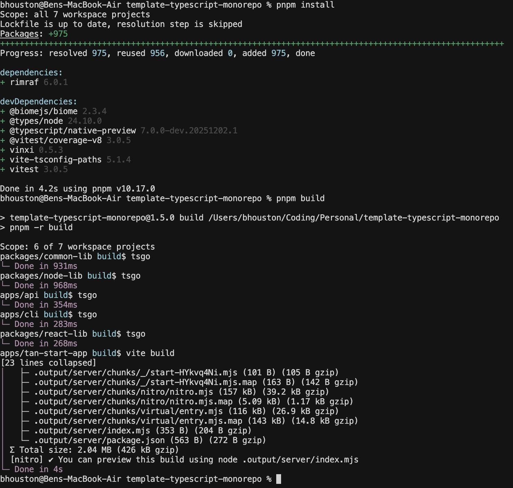

# TypeScript + Cli + Rest API + React App Mono Repository

This is a template for a monorepo that uses best practices for TypeScript, Web Services and React.

It is what @bhouston considers best practice in November 2025.

## The end result



## Features

- Mono-repository using pnpm workspaces
- TypeScript (native compiler preview) for type safety
- Incremental and composite TypeScript configuration for speed
- ES Modules for fast builds
- NodeNext node resolution
- React for UI
- Tailwindcss for styling
- Both react and vanilla JS libraries
- Command line, React app, and web server
- Vite for Bundling, CSS Handling, Live Reloading
- SDK defining schema and functions for calling REST API methods
- CLI via @yargs + file structure defined commands (via [yargs-file-commands](https://www.npmjs.com/package/yargs-file-commands))
- REST API via @fastify + file structure defined routes (via [fastify-file-router](https://www.npmjs.com/package/fastify-file-router))
- @TanStack/start for router, SSR, server API
- Fastify for server with file-based router
- Hot reload of React
- Auto service restart for the web server
- Oxlint for linting and Oxfmt for code formatting
- VSCode (OXC) auto-format on save and paste
- Google Analytics (GA4) via [tanstack-router-ga4](https://www.npmjs.com/package/tanstack-router-ga4)
- Vitest for testing with coverage support
- E2E testing for the TanStack Start app via @vitest/browser
- CLI tested via [vitest-command-line](https://www.npmjs.com/package/vitest-command-line) (subprocess helpers and matchers)
- Github action CI

## Architecture

### Shared SDK Package

This monorepo uses a **shared SDK package** (`packages/sdk`) that provides a single source of truth for API contracts, ensuring type safety and reducing duplication across the entire platform.

**Key Benefits:**

- **Single Source of Truth**: API schemas (params, query, body, response) are defined once in the SDK using Zod
- **Type Safety**: Shared types ensure API, CLI, and frontend stay in sync
- **Reduced Duplication**: No need to duplicate schemas or API client code
- **Consistency**: All API calls go through validated SDK functions

**How It Works:**

1. **SDK Defines Schemas**: The SDK package (`packages/sdk`) defines Zod schemas for all API routes:
   - Request parameters (path params, query params, body)
   - Response types
   - Validation rules

2. **Fastify API Uses SDK Schemas**: The Fastify API (`apps/api`) imports schemas from the SDK and uses them for route validation:

   ```typescript
   import { getUserParamsSchema, userSchema } from '@bhouston/sdk';

   export const route = defineRouteZod({
     schema: {
       params: getUserParamsSchema,
       response: { 200: userSchema },
     },
     // ...
   });
   ```

3. **CLI Uses SDK Functions**: The CLI tool (`apps/cli`) uses SDK functions to make API calls:

   ```typescript
   import { getUser } from '@bhouston/sdk';
   const user = await getUser(client, { params: { userName: 'john' } });
   ```

4. **Frontend Uses SDK Functions**: The TanStack Start app (`apps/tan-start-app`) uses SDK functions for client-side API calls:
   ```typescript
   import { healthCheck, hello } from '@bhouston/sdk';
   await healthCheck(client);
   const result = await hello(client, { query: { name: 'World' } });
   ```

This architecture ensures that when API contracts change, TypeScript will catch mismatches across all consumers (API, CLI, and frontend) at compile time, preventing runtime errors and reducing maintenance burden.

## Getting Started

1. Clone this repository
2. Run `pnpm install`

## Development

```bash
pnpm install
pnpm dev
pnpm tsc   # tsgo -b (typecheck/build)
pnpm build
pnpm lint  # oxlint
pnpm lint:fix
pnpm format # oxfmt
pnpm test  # vitest
```

### Tests

1. Run `pnpm test` to run all tests
2. Run `pnpm test:watch` for watch mode during development
3. Run `pnpm test:coverage` to generate test coverage report

### E2E tests (TanStack Start app)

The TanStack Start app includes browser-based e2e tests using [@vitest/browser](https://main.vitest.dev/guide/browser) with the Playwright provider. From the app directory:

```bash
cd apps/tan-start-app && pnpm test:e2e
```

This starts the app dev server, runs the e2e suite in a real browser (Chromium), then shuts the server down. Tests live in `apps/tan-start-app/e2e/` and use a custom `openAppPage` command to drive the running app.

4. The CLI app is tested with [vitest-command-line](https://www.npmjs.com/package/vitest-command-line), which runs the real CLI as a subprocess and provides matchers like `toSucceed()` and `toHaveStdout()`

### Continuous Dev Build

1. Run `pnpm dev` to start the hot reload development server & build watchers

### Typecheck & Production JavaScript

1. Run `pnpm tsc` (or `pnpm tsgo`), uses incremental composite builds to run fast on large projects

### Optimized Production Build

1. Run `pnpm build` to build the source (uses tsgo on all projects, then vite build on TanStack server)
2. Run `pnpm start` to run the production server

### Command Line

1. Run `pnpm cli` to run the CLI example
2. The CLI uses SDK functions to interact with the Fastify API
3. Example commands:
   - `pnpm cli health` - Check API health
   - `pnpm cli hello --name "World"` - Call hello endpoint
   - `pnpm cli users list` - List users
   - `pnpm cli users get <userName>` - Get user details

### Monorepo Structure

- `packages/sdk/` - Shared SDK with Zod schemas and API client functions
- `packages/common-lib/` - Shared utilities and helpers
- `packages/node-lib/` - Node.js-specific utilities
- `packages/react-lib/` - React components and hooks
- `apps/api/` - Fastify REST API server (uses SDK schemas for validation)
- `apps/cli/` - Command-line interface (uses SDK functions)
- `apps/tan-start-app/` - TanStack Start React app (uses SDK functions)

## Author

[Ben Houston](https://ben3d.ca), Sponsored by [Land of Assets](https://landofassets.com)
